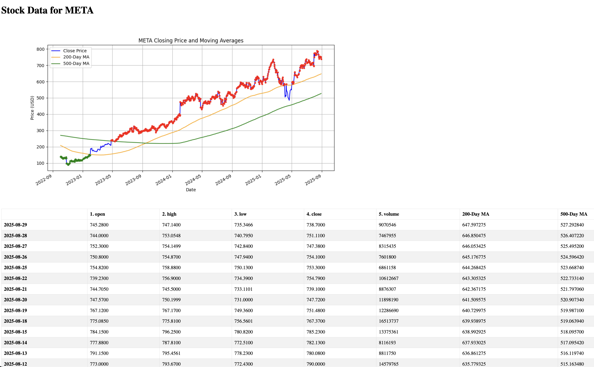
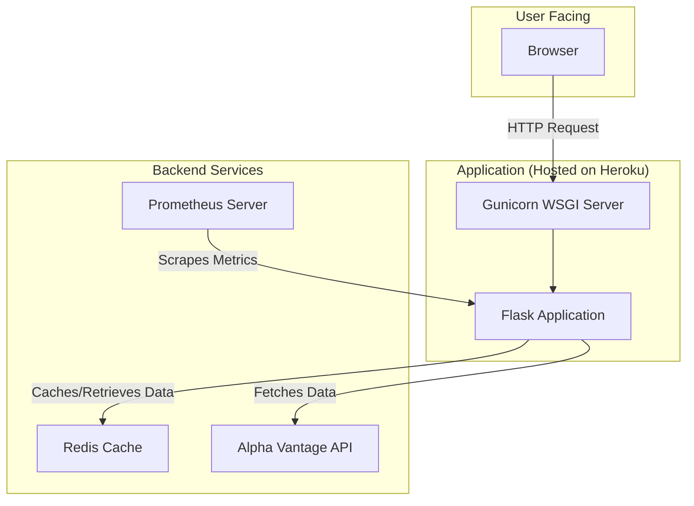
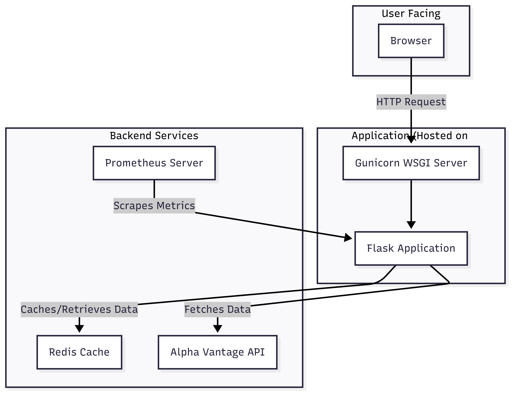
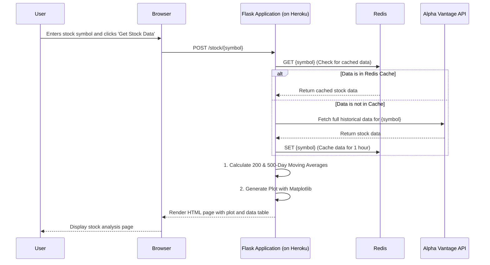
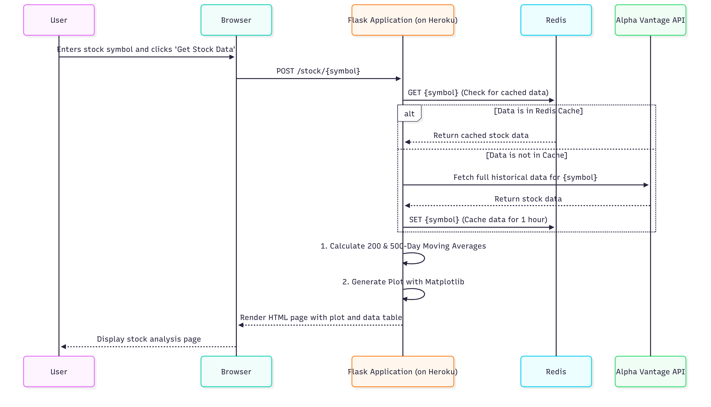

# Stock Analysis Web Application

A Python-based web application for fetching, analyzing, and visualizing stock market data using Flask, Redis, and Alpha Vantage.

## Key Features

-   **Dynamic Stock Data Fetching**: Fetches full historical daily stock data from the Alpha Vantage API.
-   **Data Analysis**: Calculates 200-day and 500-day simple moving averages (MA).
-   **Web Dashboard**: A clean web interface to search for a stock symbol and view its data.
-   **Data Visualization**: Generates and displays a chart of the closing price, 200-day MA, and 500-day MA. The chart uses color-coded dots to indicate when the price is above (red) or below (green) both moving averages.
-   **REST API**: Exposes stock data, including moving averages, via a JSON API endpoint.
-   **Performance Caching**: Utilizes Redis to cache API responses for one hour, significantly improving performance on repeated lookups.
-   **Automated Testing**: A comprehensive test suite using `pytest` with unit tests for data analysis and integration tests for application endpoints. Mocks are used to simulate external services like the Alpha Vantage API and Redis.
-   **CI/CD Pipeline**: A full Continuous Integration and Continuous Delivery pipeline using GitHub Actions. The workflow automatically runs tests on every push and deploys the application to Heroku from the `main` branch.
-   **Production Monitoring**: Exposes a `/metrics` endpoint compatible with Prometheus for production monitoring of request latency, counts, and other key metrics.

## Application Screenshots

### 1. Home Page

A simple, clean interface with a single input field for users to enter a stock symbol (e.g., 'AAPL').


### 2. Stock Data View

After searching, the user is presented with a detailed view that includes:
-   A chart visualizing the closing price, 200-day MA, and 500-day MA over the last two years.
-   A data table showing the full historical daily data, including open, high, low, close, volume, and the calculated moving averages.



## System Architecture

The application follows a monolithic architecture but is designed with a clear separation of concerns. The diagrams below illustrate the system's structure and the flow of a typical user request.

### Component Diagram

This diagram shows the main components of the system and their relationships.




### Sequence Diagram: User Request Flow

This diagram shows the sequence of events when a user requests stock data.




## Design Decisions and Trade-offs

Several key design decisions were made during the development of this project. This section outlines the reasoning behind these choices and the trade-offs involved.

### 1. Framework: Flask vs. Django

-   **Decision**: Use Flask.
-   **Reasoning**: Flask is a lightweight and flexible micro-framework, which was ideal for this project's well-defined scope. It provided full control over the application's components without imposing a rigid structure. This simplicity allowed for a faster initial setup and a focus on core features.
-   **Trade-off**: Unlike a full-featured framework like Django, Flask does not come with built-in components like an ORM or an admin panel. These would have to be added manually. For this project, where the data is ephemeral and fetched from an external API, a database and ORM were unnecessary, making Flask a more suitable choice.

### 2. Architecture: Monolithic vs. Microservices

-   **Decision**: A monolithic architecture.
-   **Reasoning**: For a single-purpose application developed by one person, a monolithic architecture is significantly simpler to build, test, and deploy. It avoids the complexities of inter-service communication, distributed data management, and maintaining multiple deployment pipelines that come with a microservices approach.
-   **Trade-off**: A monolith is less scalable than a microservices architecture. If one part of the application (e.g., the plot generation) becomes a performance bottleneck, it can affect the entire system. However, given the scope of this project, the simplicity and ease of development of a monolith far outweighed the need for massive scalability.

### 3. Data Persistence: Redis as a Cache vs. a Database

-   **Decision**: Use Redis as a cache, not a persistent database.
-   **Reasoning**: The application's data is sourced from an external API and does not need to be stored permanently. The primary goal was to improve performance and reduce API rate-limiting issues. Redis, as an in-memory data store, is exceptionally fast and perfect for caching. It significantly speeds up requests for recently viewed stocks.
-   **Trade-off**: Data stored in Redis is volatile and can be lost if the server restarts. This is an acceptable trade-off because the application can always refetch the data from the Alpha Vantage API as the source of truth.

### 4. Plotting: Backend (Matplotlib) vs. Frontend (JavaScript)

-   **Decision**: Generate plots on the backend with Matplotlib.
-   **Reasoning**: Using a Python library like Matplotlib kept the entire stack consistent and simple. It allowed for complex plot customizations (like the color-coded dots) to be handled with Python logic, avoiding the need to create a separate API endpoint to feed data to a frontend charting library.
-   **Trade-off**: The generated charts are static images and are not interactive. A frontend JavaScript library (like Chart.js or D3.js) would allow for features like zooming, panning, and tooltips on hover. For the requirements of this project, a static, informative image was sufficient and much simpler to implement.

## CI/CD Pipeline

The project uses GitHub Actions for CI/CD. The workflow is defined in `.github/workflows/ci.yml` and performs the following steps:

1.  **On Push or Pull Request to `main`**:
    -   A `build` job is triggered.
    -   It checks out the code, sets up Python, and installs all dependencies from `requirements.txt`.
    -   It runs the entire `pytest` test suite.

2.  **On Push to `main` (after `build` succeeds)**:
    -   A `deploy` job is triggered.
    -   It uses a third-party action to deploy the application to a pre-configured Heroku app.

## Quick Start

**Prerequisites**:
-   Python 3.9+
-   Redis server running locally.
-   Git

**Running the System**:
1.  **Clone the repository** and navigate into the directory.
2.  **Create and activate a virtual environment**:
    ```bash
    python3 -m venv venv
    source venv/bin/activate
    ```
3.  **Install dependencies**:
    ```bash
    pip install -r requirements.txt
    ```
4.  **Configure environment variables** by creating a `.env` file and setting your `ALPHA_VANTAGE_API_KEY`.
5.  **Run the application**:
    ```bash
    python main.py
    ```
6.  **Access the application** at `http://127.0.0.1:5000`.

## API and Metrics Endpoints

### REST API

-   **Endpoint**: `/api/stock/<symbol>`
-   **Method**: `GET`
-   **Description**: Returns the full historical data and moving averages for a given stock symbol.
-   **Success Response (200 OK)**: A JSON object containing the data.
-   **Error Response (404 Not Found)**: `{"error": "Data not found for symbol <symbol>"}`

### Monitoring

-   **Endpoint**: `/metrics`
-   **Method**: `GET`
-   **Description**: Exposes application metrics in a format that can be scraped by a Prometheus server. Includes default metrics like request latency and counts.

## Testing

The project includes a robust test suite in the `tests/` directory.

-   `tests/test_analyzer.py`: Unit tests for the moving average calculation logic.
-   `tests/test_app.py`: Integration tests for the web routes and API endpoints. These tests use `pytest-mock` to simulate API calls and Redis connections, ensuring tests are fast and reliable.

To run the tests, execute the following command from the project root:

```bash
pip install pytest
pytest
```

## Configuration

The application is configured using environment variables, which should be stored in a `.env` file in the project root.

-   `SECRET_KEY`: A secret key for Flask session management.
-   `ALPHA_VANTAGE_API_KEY`: Your API key for the Alpha Vantage service.
-   `REDIS_URL`: The connection URL for your Redis server (e.g., `redis://localhost:6379/0`).
